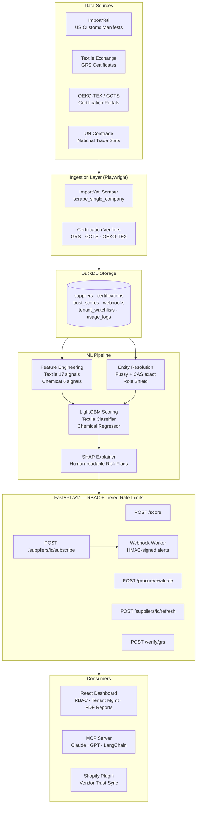

# SourceGuard

**AI-powered supplier due diligence for autonomous procurement.**

Transforms raw customs data, certification records, and B2B trade signals into a structured **Trust Score (0–100)** with SHAP-driven, human-readable risk flags. Built for AI procurement agents and trade intelligence teams who need to evaluate hundreds of suppliers in seconds — without a compliance team.

---

## The Problem

Global B2B procurement is broken:

- **30–40% of textile suppliers** presenting themselves as manufacturers are actually middlemen or brokers — adding cost, risk, and opacity to the supply chain.
- Buyers spend weeks manually verifying certifications (GOTS, OEKO-TEX), cross-checking trade records, and calling references — only to still get burned.
- Emerging **AI procurement agents** (autonomous buying systems) have no structured trust layer to filter supplier databases before placing orders.

---

## 🛡 Security & Authentication

The Supplier Trust Engine uses a production-grade identity and access management (IAM) system:

1.  **Dashboard Access**: Secured with **JWT-based sessions**, **Bcrypt** password hashing, and role-based access control (RBAC). 
    - Admin: Full system access.
    - Tenant Admin: Manage keys and users for their own startup.
    - Viewer: Read-only access to trust scores.
2.  **API Access (for AI Agents)**: Stateless `X-API-Key` headers. Each key is linked to a tenant tier with **hard RPM and monthly quotas**.
3.  **Super-User Bypass**: Legacy `X-Admin-Token` for emergency developer access.

### Quickstart (Local)

1.  **Clone & Install**: `pip install -r requirements.txt && playwright install chromium`
2.  **Seed Database**: `python seed_db.py`
3.  **Seed Identity**: `python scripts/seed_users.py` (Creates `admin@datavibe.io` / `admin_password_123`)
4.  **Run API**: `python api/main.py`
5.  **Run Dashboard**: `cd dashboard && npm install && npm run dev`

---

## What It Does

The Supplier Trust Engine automates the entire supplier vetting workflow for the autonomous economy:

1. **Scrapes** supplier shipment history in real-time or batch via Playwright.
2. **Verifies** certifications (GOTS, OEKO-TEX, and **GRS**) directly from issuing-body portals.
3. **Multi-Vertical Scoring**: Features specialized LightGBM models for **Textiles** and **Chemicals/Polymers**.
4. **Engineers 20+ features** (CAS density, purity index, customer concentration, etc.).
5. **Temporal Tracking**: Tracks trust score history and triggers **Webhook alerts** on significant drops.
6. **Resolves** messy names to canonical entities with adaptive fuzzy matching and **Role Shield** protection.
7. **Marketplace Sync**: Seamlessly pushes trust scores into **Shopify** or **Faire** storefronts.

---

## Business Model

### Who Pays

| Customer | Pain | Willingness to Pay |
|:---|:---|:---|
| **AI procurement startups** | Their agents need a trust layer before executing orders | API subscription — $500–$5,000/mo |
| **Fashion/retail sourcing teams** | Currently pay $10k+/yr for manual audits | SaaS seat license — $200–$800/user/mo |
| **Trade finance / factoring firms** | Need supplier risk scores before advancing cash against invoices | Per-score API calls — $0.50–$5.00/score |
| **Supply chain compliance SaaS** | Want to embed trust signals into existing platforms | White-label data license — $2k–$20k/mo |

### Revenue Streams

```
Tier 1 — API Access       $299/mo    → 1,000 scores/mo
Tier 2 — Growth           $999/mo    → 10,000 scores/mo + procurement endpoint
Tier 3 — Enterprise       Custom     → Dedicated instance, custom data sources, SLA
Data License              Custom     → Bulk trust scores for platforms (Tier 1 customer → Shopify, Faire, etc.)
```

### Market Size

- Global supply chain risk management market: **$19.3B by 2028** (CAGR 15.1%)
- Textile/apparel sourcing software: **$3.2B** addressable
- AI procurement automation: fastest-growing sub-segment, 3-5 new funded startups/quarter

### Competitive Moat

| Competitor | Gap |
|:---|:---|
| Panjiva / ImportGenius | Raw data, no scoring, no AI agent API |
| Sourcemap | Mapping focus, not risk scoring |
| Sedex / EcoVadis | Survey-based, slow, expensive, no API |
| **This product** | Real-time scored API + SHAP explanations + AI-agent-native design |

---

## Architecture



---

## Trust Score Features (20+ signals)

### 👗 Textile Category
| Feature | What It Measures | Middleman Signal |
|:---|:---|:---|
| `certification_score` | Weighted GOTS (2pt) + OEKO-TEX (1pt) | 0 = no verified certs |
| `has_any_valid_cert` | Binary: any live certification | 0 = no proof of standards |
| `hs_chapter_diversity` | Number of distinct HS chapters | Middlemen spread wide |

### 🧪 Chemical Category
| Feature | What It Measures | Manufacturer Signal |
|:---|:---|:---|
| `cas_linkage_score` | Density of valid CAS numbers in trade logs | High = real producer |
| `grade_purity_index` | Matches for Reagent/USP/Food vs Tech grade | High = advanced lab/facility |
| `regulatory_hub_score`| Facility presence in primary chemical hubs | High = higher compliance |

---

## Entity Resolution

The engine resolves messy, real-world supplier names to canonical entities using a two-pass pipeline:

### Textile resolution
- Casefold + punctuation normalization → fuzzy token match (RapidFuzz)
- Adaptive threshold: `min(BASE + Laplace_rate × PENALTY, MAX)` — tightens automatically as rejections accumulate for a canonical
- Subsidiary and alias detection with `is_subsidiary_warning` flag

### Chemical resolution
- **CAS Registry Number** exact match (checksum-validated) — bypasses fuzzy entirely when a CAS is present in the name
- Longest-first abbreviation expansion (LLDPE before LDPE, PET before PE)
- Token order preserved — "Ethylene Oxide" ≠ "Oxide Ethylene"
- **Role Shield**: strips `C/O`, `VIA`, `BY` clusters from logistics surrogates; returns `is_role_warning: true` when the original name contained role noise

```
"SABIC C/O XYZ LOGISTICS"  →  canonical: sabic-global  (is_role_warning: true)
"9002-88-4"                →  canonical: cas-9002-88-4  (match_type: cas_exact)
"HDPE GRANULS"             →  candidate queued         (adaptive threshold blocked)
```

### Admin Review Dashboard
Unverified alias candidates surface in a prioritised queue with:
- **Priority score** = 0.4×volume + 0.3×trust + 0.3×match_score
- **Threshold badge** (green/yellow/red) showing the current adaptive threshold per canonical
- **CAS badge** (purple) linking to CAS Common Chemistry registry
- **Role Warning badge** (orange) on any alias containing `C/O`, `VIA`, or `BY`
- Bulk verify / reject with checkboxes + floating action bar
- Snapshot-based undo within 24 h via the Audit Feed

---

## Risk Flag Examples (SHAP-driven)

Every score includes plain-English explanations of *why* a supplier scored the way it did:

```json
{
  "trust_score": 18.5,
  "risk_flags": [
    "High customer concentration (captive factory risk)",
    "Missing or weak certifications",
    "Inactive recently (no recent shipments)"
  ]
}
```

---

## Project Structure

```
Supplier-Trust-Engine/
├── api/
│   ├── main.py                   # FastAPI app — all /v1/ endpoints + security middleware
│   ├── auth.py                   # JWT + API-key auth, tiered rate-limit callable
│   ├── resolver.py               # EntityResolver — adaptive fuzzy + CAS exact match
│   ├── chemical_normalizer.py    # CAS extraction, abbreviation expansion, Role Shield
│   ├── decision_engine.py        # AI procurement decision engine
│   ├── webhook_worker.py         # Async HMAC-signed webhook delivery
│   └── plugins/
│       └── shopify_connector.py  # Shopify vendor sync plugin (mockup)
├── pipeline/
│   ├── spiders/
│   │   └── importyeti_scraper.py # Playwright scraper + scrape_single_company trigger
│   ├── verifiers/
│   │   ├── certification_verifier.py  # OEKO-TEX + GOTS async verifier
│   │   └── grs_verifier.py            # GRS real-time Playwright verifier
│   ├── ingest/
│   │   ├── comtrade_client.py    # UN Comtrade trade stats ingestion
│   │   └── manifest_scraper.py   # Bill of lading manifest verification
│   ├── ingest_polymers.py        # Chemical/polymer seed data + Role Shield priming
│   ├── entity_resolution.py      # resolve_and_upsert helper for scraper output
│   └── storage/
│       └── db.py                 # DuckDB schema — all tables, migrations, views
├── model/
│   ├── features.py               # Textile feature engineering (17 signals)
│   ├── features_chemical.py      # Chemical feature engineering (CAS, purity, regulatory)
│   ├── train_chemical.py         # Chemical LightGBM regressor training script
│   ├── scorer.py                 # Multi-category scoring + SHAP + history logging
│   ├── trust_model.pkl           # Trained textile model artifact
│   ├── shap_explainer.pkl        # Textile SHAP TreeExplainer
│   ├── chemical_trust_model.pkl  # Trained chemical model artifact
│   └── chemical_shap_explainer.pkl  # Chemical SHAP TreeExplainer
├── dashboard/
│   ├── src/
│   │   ├── App.jsx               # Main dashboard shell
│   │   ├── api.js                # API client (proxied via nginx/Vite)
│   │   └── components/
│   │       ├── StatGrid.jsx              # 4-card KPI summary
│   │       ├── SupplierTable.jsx         # Filterable trust score table
│   │       ├── SupplierModal.jsx         # Full supplier detail panel
│   │       ├── ProcurementSimulator.jsx  # Live AI decision engine UI
│   │       └── AdminDashboard.jsx        # Alias review queue + audit feed
│   ├── Dockerfile                # Multi-stage: node build → nginx serve
│   └── nginx.conf                # Reverse proxy + API key injection
├── data/
│   ├── seed_suppliers.py         # 50 synthetic suppliers for dev/demo
│   └── labeled_suppliers.csv     # Binary risk labels for training
├── tests/
│   ├── test_smoke.py             # DB schema, upsert idempotency, feature engineering
│   ├── test_admin_api.py         # Admin queue, verify/reject, bulk, 403, category filter
│   ├── test_active_learning.py   # Adaptive threshold dynamics (Laplace smoothing)
│   ├── test_chemical_normalizer.py # CAS extraction, abbreviation expansion, noise stripping
│   └── test_role_shield.py       # C/O stripping, surrogate flag, resolver warning
├── scripts/
│   └── phase3_ingest.py          # Comtrade + manifest ingestion orchestrator
├── Dockerfile                    # API image (python:3.10-slim + libgomp1)
├── docker-compose.yml            # Two-service stack (api + dashboard)
├── entrypoint.sh                 # Auto-seeds + trains on first boot
├── run_pipeline.py               # CLI orchestrator for all pipeline steps
├── WALKTHROUGH.md                # V2 feature walkthrough and demo script
└── requirements.txt
```

---

## API Reference

All endpoints are under `/v1/`. Rate limits are tier-aware for `X-API-Key` routes.

### Public / Dashboard

| Endpoint | Rate Limit | Description |
|:---|:---|:---|
| `GET /v1/health` | 60/min | Healthcheck |
| `GET /v1/stats` | 60/min | Dashboard aggregate counts |
| `GET /v1/suppliers` | 5/min | Filtered supplier list |
| `GET /v1/supplier/{id}` | 30/min | Full trust profile |

### Tenant API (X-API-Key required)

| Endpoint | Rate Limit | Description |
|:---|:---|:---|
| `POST /v1/score` | tier-based | Score supplier by name or ID |
| `POST /v1/procure/evaluate` | tier-based | AI procurement decision engine |
| `POST /v1/resolver/feedback` | tier-based | Confirm or reject a name resolution |
| `POST /v1/suppliers/{id}/refresh` | 2/min | On-demand re-scrape + re-score |
| `POST /v1/verify/grs` | 5/min | Real-time GRS certificate check |
| `POST /v1/integrations/shopify/sync` | 5/min | Sync vendor trust scores to Shopify |

Tier rate limits (requests per minute):

| Tier | RPM |
|:---|:---|
| tier_1 | 20 |
| tier_2 | 100 |
| enterprise | 1000 |

### Admin (X-Admin-Token or JWT admin role)

| Endpoint | Description |
|:---|:---|
| `GET /v1/admin/review-queue` | Prioritised alias review queue |
| `POST /v1/admin/alias/action` | Bulk verify or reject aliases |
| `GET /v1/admin/audit-logs` | Recent action history |
| `POST /v1/admin/audit/undo` | Snapshot-based undo (24 h window) |
| `POST /v1/admin/tenants` | Create a new tenant |
| `POST /v1/admin/tenants/{id}/keys` | Issue an API key for a tenant |
| `GET /v1/admin/tenants` | List all tenants and key counts |
| `GET /v1/admin/usage` | Usage analytics across all tenants |

### `GET /v1/health`
```json
{ "status": "ok", "service": "textile-trust-engine", "suppliers_in_db": 50 }
```

### `POST /v1/score` _(API key required)_
```bash
curl -X POST https://your-domain.com/api/v1/score \
  -H "X-API-Key: your-key" \
  -H "Content-Type: application/json" \
  -d '{"supplier_name": "Welspun India"}'
```
```json
{
  "supplier_id": "welspun-india-ltd",
  "supplier_name": "Welspun India Ltd",
  "country": "India",
  "trust_score": 100.0,
  "risk_probability": 0.0,
  "risk_flags": [],
  "certification_status": {
    "gots":    { "status": "valid", "valid_until": "2026-03-15" },
    "oekotex": { "status": "valid", "valid_until": "2025-11-30" }
  },
  "shipment_summary": {
    "total_shipments": 412,
    "avg_monthly": 28.5,
    "total_buyers": 14,
    "last_shipment": "2025-12-01"
  },
  "resolution_metadata": {
    "match_type": "fuzzy",
    "match_score": 96.4,
    "canonical_name": "Welspun India Ltd",
    "low_confidence": false
  }
}
```

### `POST /v1/procure/evaluate` _(API key required)_

The **AI Decision Engine** — send procurement criteria, receive a ranked shortlist with rationale.

```bash
curl -X POST https://your-domain.com/api/v1/procure/evaluate \
  -H "X-API-Key: your-key" \
  -H "Content-Type: application/json" \
  -d '{
    "category": "organic cotton tote bags",
    "min_trust_score": 80,
    "required_certs": ["gots"],
    "country_prefer": ["India", "Turkey"],
    "country_exclude": [],
    "max_days_inactive": 180,
    "max_results": 3
  }'
```

### `GET /v1/admin/review-queue` _(Admin token required)_
```bash
curl "https://your-domain.com/api/v1/admin/review-queue?category=chemical" \
  -H "X-Admin-Token: your-admin-token"
```
```json
[
  {
    "id": "abc123",
    "alias_name": "SABIC C/O XYZ LOGISTICS",
    "canonical_id": "sabic-global",
    "canonical_name": "SABIC Innovative Plastics",
    "match_score": 91.2,
    "priority_score": 0.7340,
    "adaptive_threshold": 91.0,
    "rejection_count": 3,
    "verification_count": 1,
    "cas_number": null,
    "is_role_warning": true
  }
]
```

### `POST /v1/admin/alias/action` _(Admin token required)_
```json
{ "alias_ids": ["abc123", "def456"], "action": "verify", "reason_code": "confirmed_manufacturer" }
```

---

## Quickstart — Local Development

### Prerequisites

- Python 3.10+
- Node.js 20+
- [ImportYeti](https://www.importyeti.com) free account

### 1. Clone & install

```bash
git clone https://github.com/Kshitijbhatt1998/Supplier-Trust-Engine
cd Supplier-Trust-Engine

python -m venv venv
venv\Scripts\activate          # Windows
# source venv/bin/activate     # macOS/Linux

pip install -r requirements.txt
playwright install chromium
```

### 2. Configure environment

```bash
cp .env.example .env
# Edit .env — fill in all required values (see Environment Variables below)
```

Generate strong secrets:
```bash
python -c "import secrets; print(secrets.token_hex(32))"  # run twice — one for API_KEY, one for ADMIN_TOKEN
```

### 3. Seed chemical/polymer data

```bash
python -m pipeline.ingest_polymers
# Seeds SABIC, Reliance, ExxonMobil, Formosa + CAS-anchored PE/PVC/PP
# Primes Role Shield rejections for known trader-manufacturer clusters
```

### 4. Run the pipeline

```bash
# Option A — Quick demo with synthetic data (no scraping)
python run_pipeline.py --seed --train --score

# Option B — Full live pipeline
python run_pipeline.py --scrape   # Collect real supplier data from ImportYeti
python run_pipeline.py --verify   # Verify GOTS + OEKO-TEX certifications
# Label suppliers in notebooks/label_suppliers.ipynb
python run_pipeline.py --train    # Train LightGBM model (textile suppliers only)
python run_pipeline.py --score    # Score all suppliers
```

### 5. Start the API

```bash
uvicorn api.main:app --reload --port 8000
# Docs: http://localhost:8000/docs
```

> The server will refuse to start if `API_KEY` or `ADMIN_TOKEN` are not set in the environment.

### 6. Start the dashboard

```bash
cd dashboard
cp .env.local.example .env.local  # or create manually
# Set VITE_API_KEY and VITE_ADMIN_TOKEN to match your .env values
npm install
npm run dev
# Dashboard: http://localhost:5173
```

---

## Quickstart — Docker (Production)

```bash
cp .env.example .env
# Set API_KEY, ADMIN_TOKEN, ALLOWED_ORIGINS, SENTRY_DSN (optional) in .env

docker compose up --build
# Dashboard → http://localhost:80
# API docs  → http://localhost:80/api/v1/docs (proxied)
```

On first boot, `entrypoint.sh` automatically seeds the database and trains the model if the volume is empty.

---

## Environment Variables

| Variable | Required | Description |
|:---|:---|:---|
| `API_KEY` | **Yes** | Secret key for protected endpoints (`X-API-Key` header). Server refuses to start if unset. |
| `ADMIN_TOKEN` | **Yes** | Secret key for admin dashboard endpoints (`X-Admin-Token` header). Server refuses to start if unset. |
| `IMPORTYETI_EMAIL` | For scraping | ImportYeti account email |
| `IMPORTYETI_PASSWORD` | For scraping | ImportYeti account password |
| `DB_PATH` | No | DuckDB file path (default: `data/trust_engine.duckdb`) |
| `ALLOWED_ORIGINS` | Production | Comma-separated allowed CORS origins (e.g. `https://yourdomain.com`) |
| `SENTRY_DSN` | Production | Sentry error tracking DSN |
| `HEADLESS` | No | `true`/`false` — show browser during scraping (default: `true`) |
| `REQUEST_DELAY_MIN` | No | Min scraper delay in seconds (default: `2.0`) |
| `REQUEST_DELAY_MAX` | No | Max scraper delay in seconds (default: `5.0`) |

---

## Security

| Control | Implementation |
|:---|:---|
| Authentication | `X-API-Key` on all POST endpoints; `X-Admin-Token` on all admin endpoints |
| Startup guard | `ValueError` raised at import if `API_KEY` or `ADMIN_TOKEN` env vars are unset |
| CORS | Env-configured allowlist — never `*` in production |
| Rate limiting | 60/min (public GET), 5/min (/suppliers), 10/min (score/admin), 5/min (procure/undo) |
| Input validation | Pydantic `Field(max_length)`, `Query(ge/le)`, list validators; `alias_ids` capped at 200 |
| Category enum | `SupplierCategory` enum validates `?category=` — rejects anything outside `textile`/`chemical` |
| Error handling | Global handler — 500s never expose stack traces; undo exceptions return generic message |
| Security headers | `X-Content-Type-Options`, `X-Frame-Options`, `Referrer-Policy`, HSTS (TLS only) |
| Session files | ImportYeti session cookies written with `chmod 600` |
| Audit undo | Snapshot schema validated (version + required keys) before any DB restore |
| Dependency scanning | GitHub Dependabot (pip + npm, weekly) |

See [SECURITY.md](SECURITY.md) for the full security design and vulnerability reporting process.

---

## Running Tests

```bash
# All tests
pytest tests/ -v

# Specific suites
pytest tests/test_smoke.py            # DB schema + feature engineering
pytest tests/test_admin_api.py        # Admin endpoints (priority queue, bulk action, auth)
pytest tests/test_active_learning.py  # Adaptive threshold / Laplace smoothing
pytest tests/test_chemical_normalizer.py  # CAS extraction, abbreviation expansion
pytest tests/test_role_shield.py      # C/O stripping, surrogate flag, Role Shield
```

---

## Fixing Scraper Selectors

ImportYeti's DOM changes periodically. If scraped fields return `null`:

1. Open any `importyeti.com/company/` page in Chrome
2. DevTools → Elements → find the field → Copy selector
3. Update in [pipeline/spiders/importyeti_scraper.py](pipeline/spiders/importyeti_scraper.py) under `_scrape_supplier()`

Set `HEADLESS=false` in `.env` to watch the browser live while debugging.

Key selectors to verify:

| Field | Current selector |
|:---|:---|
| Company name | `h1` |
| Country | `[data-testid='supplier-country']` |
| Shipment count | `[data-testid='total-shipments']` |
| HS codes | `[data-testid='hs-code-tag']` |
| Buyers | `[data-testid='buyer-name']` |

---

## Trust Score Reference

| Score | Risk Level | Meaning |
|:---|:---|:---|
| 80–100 | Low | Strong manufacturer signals — safe to proceed |
| 60–79 | Moderate | Verify the specific flags before committing |
| 40–59 | Elevated | Proceed with caution — request additional documentation |
| 0–39 | High | Likely middleman or compliance gap — do not source |

---

- [x] Admin Review Dashboard with adaptive threshold God View
- [x] Multi-industry support (textile + chemical/polymer)
- [x] CAS Registry Number exact-match resolver
- [x] Role Shield — C/O / VIA / BY surrogate detection
- [x] Snapshot-based audit undo
- [x] GRS (Global Recycled Standard) certification verifier
- [x] Chemical category LightGBM model (dedicated feature engineering)
- [x] Supplier changelog — track score changes over time
- [x] Webhook alerts when a supplier's score drops below threshold
- [x] Shopify / Faire plugin for direct store integration
- [x] Multi-tenant API with per-customer supplier databases (Overlay Model)
- [x] Real-time scraping triggers (score on demand, not just batch)
- [ ] **Predictive Lead Times**: Forecast fulfillment delays based on port congestion
- [ ] **ESG Scraper**: Extract real-time ESG commitments from supplier PDF reports

---

## Tech Stack

| Layer | Technology |
|:---|:---|
| Scraping | Playwright (async, JS-rendered pages) |
| Storage | DuckDB (embedded analytical DB — no server required) |
| Feature engineering | Pandas + NumPy |
| ML model | LightGBM (gradient boosted trees) |
| Explainability | SHAP TreeExplainer |
| Entity resolution | RapidFuzz + Laplace-smoothed adaptive thresholds |
| Chemical normalization | CAS checksum validation, longest-first abbreviation expansion |
| API | FastAPI + slowapi (rate limiting) + Pydantic v2 |
| Frontend | React 18 + Vite 6 |
| Containerisation | Docker + Docker Compose (nginx reverse proxy) |
| Error tracking | Sentry |
| Dependency scanning | GitHub Dependabot |
| CI data | UN Comtrade API (national trade statistics) |

---

## License

MIT — use freely, attribution appreciated.

---

*Built by [Kshitij Bhatt](https://github.com/Kshitijbhatt1998) · SourceGuard — Supplier intelligence for the autonomous economy*
